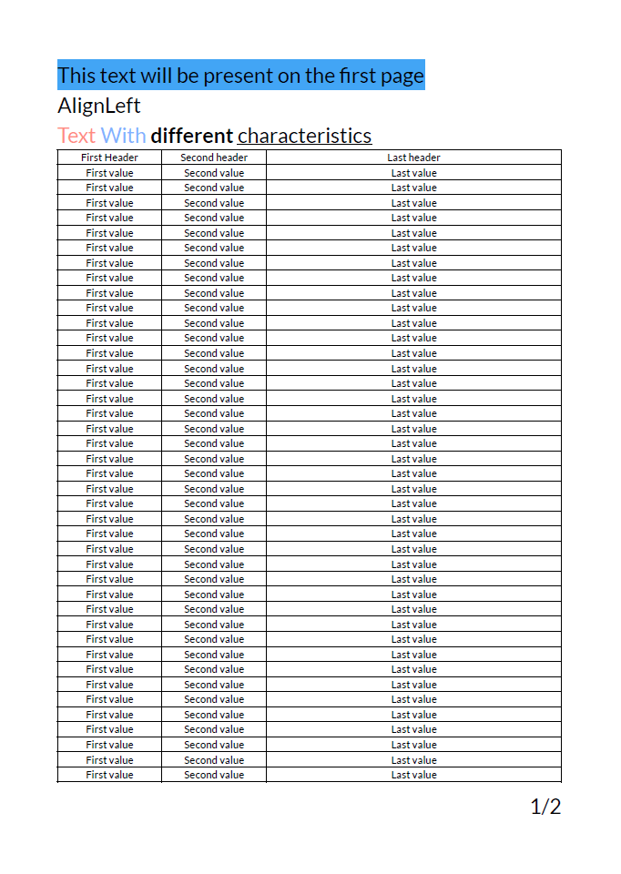

# QuestPDF Example

This is an example of PDF generated by QuestPDF.

Version used: [2023.12.6](https://www.nuget.org/packages/QuestPDF/2023.12.6)

License: [Community](https://www.questpdf.com/license/summary/community.html)

## Results

### Simple PDF

### Multiple merged documents

The result is the Simple PDF x3, you can see the implementation on Program.cs
